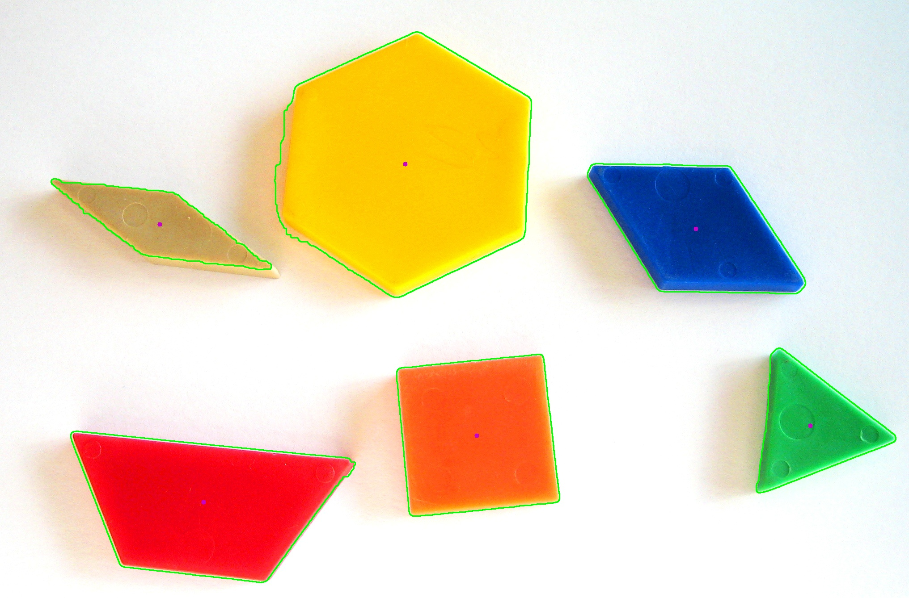

# ContourFinder

## Description
A Python tool using OpenCV to detect and draw contours and centers of objects in an image. It allows real-time parameter adjustments for kernel size, HSV thresholds, and dilation/erosion iterations through interactive trackbars.

## Features
- Real-time image processing with adjustable parameters
- Detects and draws contours and their centers
- Uses HSV color space for better thresholding
- Applies Gaussian blur and morphological transformations

## Before and After

### Original Image

### Processed Image

